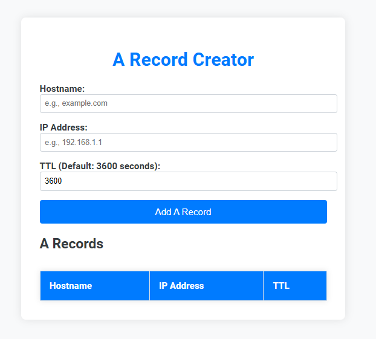

# A Record Creator

## Overview
A Record Creator is a simple web application that allows users to create DNS A records by specifying a hostname, IP address, and TTL (time-to-live) value. This tool is particularly useful for networking engineers, system administrators, and IT professionals who need to quickly create and manage DNS A records, which are essential for mapping domain names to IP addresses.

## Features
- Input hostname, IP address, and TTL value.
- Validate IP address format to ensure correctness.
- Automatically set a default TTL value of 3600 seconds if not specified.
- Display created A records in an easy-to-read table.
- User-friendly, responsive design that works well on both desktop and mobile devices.

## Usage
1. **Clone the repository**: Clone the repository to your local machine using the following command:
   ```sh
   git clone https://github.com/yourusername/a-record-creator.git
   ```

2. **Open the application**: Open the `index.html` file in your preferred web browser.

3. **Input details**: Fill in the fields for hostname, IP address, and TTL.
   - The IP address field validates the input to ensure it is in a correct format.
   - The TTL field is pre-filled with a default value of `3600`.

4. **Add the A record**: Click the "Add A Record" button to add the record to the table below.

5. **View the records**: The newly added A record will be displayed in the table, showing the hostname, IP address, and TTL value.

## Screenshot


## Why This App is Useful for Networking Engineers
- **Efficiency**: Quickly create A records without needing direct access to complex DNS management systems.
- **Validation**: The IP address input is validated to ensure records are accurate and avoid mistakes.
- **Simplicity**: Provides a streamlined way to manage DNS entries with minimal setup.

## Technologies Used
- **HTML5**: Structure of the application.
- **CSS3**: Styling, including responsive layout for different screen sizes.
- **JavaScript**: Functionality for adding A records, validating inputs, and updating the DOM.

## Future Enhancements
- **Local Storage**: Store the created A records locally so that they are available after refreshing the page.
- **Export Functionality**: Allow users to export the A records as a CSV file for easy use in other systems.
- **Advanced Validation**: Enhance IP address validation to include IPv6 support.

## Contributing
Contributions are welcome! If you would like to contribute, please follow these steps:
1. Fork the repository.
2. Create a new branch (`git checkout -b feature-branch`).
3. Commit your changes (`git commit -m 'Add some feature'`).
4. Push to the branch (`git push origin feature-branch`).
5. Open a pull request.

## License
This project is open source and available under the [MIT License](LICENSE).

## Contact
If you have any questions, feel free to reach out to [Dustin Moore](https://www.linkedin/in/dustinmmoore).

