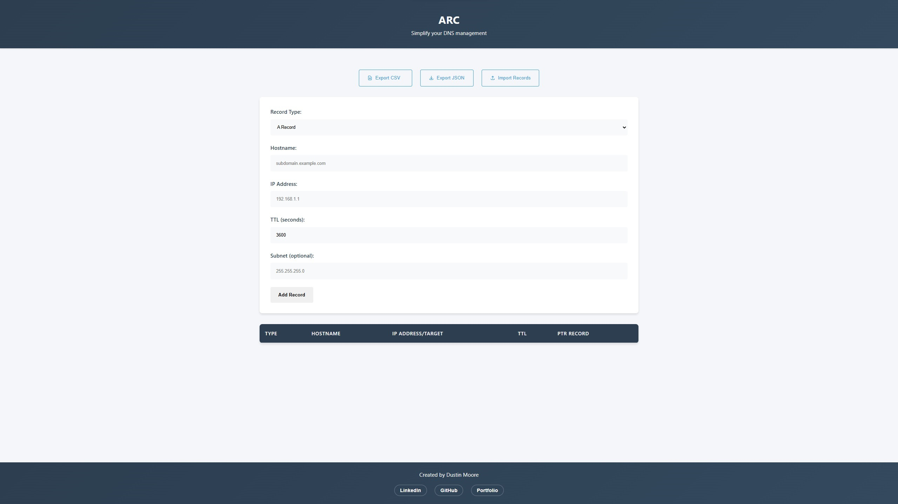

# A Record Creator

A professional DNS A Record management tool developed by Dustin Moore, a Full Stack Developer specializing in JavaScript, React, and NEXT.js.

[LinkedIn](https://www.linkedin.com/in/dustinmmoore) | [GitHub](https://github.com/dustinmmoore)

## Overview

A Record Creator is a simple web application designed to help networking engineers, system administrators, and IT professionals quickly create and manage DNS A records, which are essential for mapping domain names to IP addresses.

## Features

- **Dual Record Type Support**: Create both A records and CNAME records from a single interface
- **A Records**: Create standard DNS A records with hostname, IP address, and TTL
- **CNAME Records**: Create CNAME records with alias and canonical name fields
- **Dynamic Form**: Form fields automatically update based on selected record type
- **Input Validation**: Comprehensive validation for both A and CNAME records
- **PTR Record Generation**: Automatic generation of reverse DNS (PTR) records for A records
- **Bulk Operations**: Import and export records in both CSV and JSON formats
- **User-Friendly Interface**: Clean, responsive design with helpful field descriptions

## Network Engineering Features

### DNS Record Types
- **A Records**: Forward DNS mapping of hostnames to IPv4 addresses
- **CNAME Records**: 
  - Alias field for specifying the domain alias
  - Canonical name field for target domain
  - Automatic validation of both alias and canonical formats
- **PTR Records**: Automatic reverse DNS record generation

### Data Validation
- IP address format verification for A records
- Hostname pattern validation
- CNAME alias and canonical name validation
- TTL value verification

### Record Management
- Color-coded record types for easy identification
- Dynamic form fields based on record type
- Monospace formatting for technical fields
- Bulk import/export capabilities

## Usage

1. **Clone the repository**: Clone the repository to your local machine using the following command:
   ```sh
   git clone https://github.com/dustinmmoore/a-record-creator.git
   ```
2. **Open the application**: Open the `index.html` file in your web browser
3. **Select record type**: Choose between A Record or CNAME Record
4. **Input details based on record type**: 
   - For A Records:
     - Enter hostname (e.g., subdomain.example.com)
     - Enter IP address
     - Set TTL (default 3600)
   - For CNAME Records:
     - Enter alias domain
     - Enter canonical (target) domain
     - Set TTL (default 3600)
5. **Add the record**: Click "Add Record" to add it to the table
6. **View and Export**: Review records in the table and export as needed

## Screenshot



## Why This App is Useful for Networking Engineers

- **Efficiency**: Quickly create A records without needing direct access to complex DNS management systems.
- **Validation**: The IP address input is validated to ensure records are accurate and avoid mistakes.
- **Simplicity**: Provides a streamlined way to manage DNS entries with minimal setup, allowing you to visualize and manage DNS entries easily.

## Technologies Used

- **HTML5**: Structure of the application.
- **CSS3**: Styling, including responsive layout for different screen sizes.
- **JavaScript**: Core functionality for adding A records, validating inputs, updating the DOM, and exporting records.

## Future Enhancements

- **Local Storage**: Store the created A records locally so they are available after refreshing the page.
- **Advanced Validation**: Include IPv6 support for IP address validation.

## Technical Implementation

This project demonstrates:

- **Modern JavaScript (ES6+)**: Class-based architecture with robust DNS record management
- **Advanced Validation**: Comprehensive input validation for networking requirements
- **Data Processing**: PTR record generation and subnet validation
- **User Experience**: Helpful placeholders and instant feedback

## Contributing

Contributions are welcome! To contribute:

1. Fork the repository.
2. Create a new branch (`git checkout -b feature-branch`).
3. Commit your changes (`git commit -m 'Add some feature'`).
4. Push to the branch (`git push origin feature-branch`).
5. Open a pull request.

## License

This project is open source and available under the [MIT License](LICENSE).

## Contact

Looking for a skilled Full Stack Developer? Contact me:

- **Email**: dustinmmoore@icloud.com
- **LinkedIn**: [LinkedIn](https://www.linkedin.com/in/dustinmmoore)
- **Portfolio**: [dustinmoore.dev](https://www.dustinmoore.dev)

If you have any questions, feel free to reach out to [Dustin Moore](https://www.linkedin.com/in/dustinmmoore).
