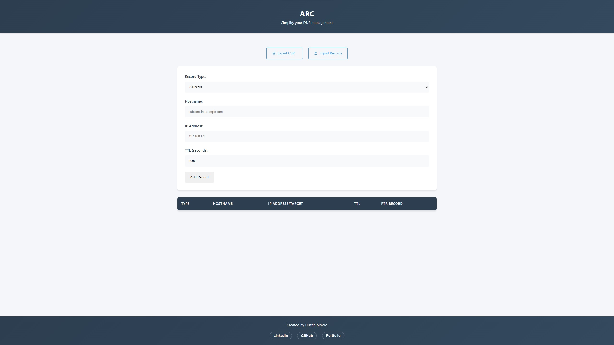

# A Record Creator

A professional DNS A Record management tool developed by Dustin Moore, a Full Stack Developer specializing in JavaScript, React, and Node.js.

## About the Developer

I'm Dustin Moore, a Full Stack Developer with expertise in:

- **Frontend**: React, JavaScript (ES6+), HTML5, CSS3
- **Backend**: Node.js, Express, REST APIs
- **Database**: MongoDB, PostgreSQL
- **Tools**: Git, Docker, AWS

[LinkedIn](https://www.linkedin.com/in/dustinmmoore) | [GitHub](https://github.com/dustinmmoore)

## Overview

A Record Creator is a simple web application designed to help networking engineers, system administrators, and IT professionals quickly create and manage DNS A records, which are essential for mapping domain names to IP addresses.

## Features

- **Input hostname, IP address, and TTL**: Specify hostname, IP address, and optionally modify the TTL value (default is 3600 seconds).
- **CNAME Record Support**: Create and manage CNAME records alongside A records.
- **Subnet Management**: Optional subnet field for better network organization.
- **PTR Record Generation**: Automatic generation of reverse DNS (PTR) records for A records.
- **Validation**: Advanced validation for IP addresses, hostnames, and subnet masks.
- **Bulk Operations**: Import and export records in both CSV and JSON formats.
- **User-Friendly Interface**: Responsive design with helpful placeholders and clear record type distinctions.

## Network Engineering Features

### Subnet Support
- Input and validate subnet masks (e.g., 255.255.255.0)
- Support for Class A, B, and C subnet patterns
- Visual subnet information display

### DNS Record Types
- **A Records**: Forward DNS mapping of hostnames to IPv4 addresses
- **CNAME Records**: Canonical name records for domain aliases
- **PTR Records**: Automatic reverse DNS record generation

### Data Validation
- IP address format verification
- Hostname pattern validation
- Subnet mask pattern checking
- CNAME target validation

### Record Management
- Color-coded record types for easy identification
- Monospace formatting for technical fields
- Bulk import/export capabilities

## Usage

1. **Clone the repository**: Clone the repository to your local machine using the following command:
   ```sh
   git clone https://github.com/dustinmmoore/a-record-creator.git
   ```
2. **Open the application**: Open the `index.html` file in your preferred web browser.
3. **Input details**: Fill in the fields for hostname, IP address, and TTL.
   - The IP address field validates the input to ensure it is in the correct format.
   - The TTL field is pre-filled with a default value of `3600`.
4. **Add the A record**: Click the "Add A Record" button to add the record to the table below.
5. **View and Export Records**: The newly added A record will be displayed in the table, and you can export all records in CSV or JSON format.

## Screenshot



## Why This App is Useful for Networking Engineers

- **Efficiency**: Quickly create A records without needing direct access to complex DNS management systems.
- **Validation**: The IP address input is validated to ensure records are accurate and avoid mistakes.
- **Simplicity**: Provides a streamlined way to manage DNS entries with minimal setup, allowing you to visualize and manage DNS entries easily.

## Technologies Used

- **HTML5**: Structure of the application.
- **CSS3**: Styling, including responsive layout for different screen sizes.
- **JavaScript**: Core functionality for adding A records, validating inputs, updating the DOM, and exporting records.

## Future Enhancements

- **Local Storage**: Store the created A records locally so they are available after refreshing the page.
- **Advanced Validation**: Include IPv6 support for IP address validation.

## Technical Implementation

This project demonstrates:

- **Modern JavaScript (ES6+)**: Class-based architecture with robust DNS record management
- **Advanced Validation**: Comprehensive input validation for networking requirements
- **Data Processing**: PTR record generation and subnet validation
- **User Experience**: Helpful placeholders and instant feedback

## Contributing

Contributions are welcome! To contribute:

1. Fork the repository.
2. Create a new branch (`git checkout -b feature-branch`).
3. Commit your changes (`git commit -m 'Add some feature'`).
4. Push to the branch (`git push origin feature-branch`).
5. Open a pull request.

## License

This project is open source and available under the [MIT License](LICENSE).

## Contact

Looking for a skilled Full Stack Developer? Contact me:

- **Email**: dustinmmoore@icloud.com
- **LinkedIn**: [LinkedIn](https://www.linkedin.com/in/dustinmmoore)
- **Portfolio**: [dustinmoore.dev](https://www.dustinmoore.dev)

If you have any questions, feel free to reach out to [Dustin Moore](https://www.linkedin.com/in/dustinmmoore).
